<picture>
  <source media="(prefers-color-scheme: dark)" srcset="assets/header-dark.svg">
  
</picture>

  
  
  

### About me

- 🇫🇷 🇨🇦 Dual citizen.
- 💼 Staff Engineer & Architect, AI Platform Core Components at [Red Hat](https://www.redhat.com).
- 📈 My current focus is productizing AI, but I also worked on Kubernetes and OpenStack projects.
- ❤️ I love Open Source, and everything about Infrastructure.
- 💬 You can reach me via [LinkedIn](https://www.linkedin.com/in/emilienmacchi).

### Tools of the trade

  

### GitHub activity

<!-- stats:start -->
<!-- Generated by scripts/generate.py: edits here are overwritten. -->

<picture>
  <source media="(prefers-color-scheme: dark)" srcset="assets/stats-dark.svg">
  
</picture>
<picture>
  <source media="(prefers-color-scheme: dark)" srcset="assets/languages-dark.svg">
  
</picture>

<picture>
  <source media="(prefers-color-scheme: dark)" srcset="assets/years-dark.svg">
  
</picture>

Same numbers, as tables

| Year | Contributions | Commits | Pull requests | Code reviews | Issues |
|---:|---:|---:|---:|---:|---:|
| 2026 (YTD) | 2,112 | 799 | 364 | 506 | 127 |
| 2025 | 1,404 | 516 | 227 | 212 | 46 |
| 2024 | 1,182 | 517 | 334 | 266 | 39 |
| 2023 | 840 | 410 | 246 | 144 | 19 |
| 2022 | 626 | 349 | 206 | 48 | 8 |
| 2021 | 945 | 441 | 370 | 87 | 16 |
| 2020 | 119 | 43 | 45 | 23 | 5 |
| 2019 | 53 | 17 | 18 | 4 | 12 |
| 2018 | 86 | 33 | 32 | 3 | 18 |
| 2017 | 20 | 8 | 3 | 6 | 3 |
| 2016 | 70 | 43 | 17 | 1 | 9 |
| 2015 | 475 | 407 | 63 | 0 | 5 |
| 2014 | 75 | 2 | 63 | 0 | 10 |
| 2013 | 15 | 7 | 5 | 0 | 3 |
| 2012 | 2 | 0 | 0 | 0 | 1 |
| **Total** | **8,024** | **3,592** | **1,993** | **1,300** | **321** |

| Language | Share of commits |
|---|---:|
| Python | 30% |
| Shell | 25% |
| Go | 21% |
| HTML | 11% |
| Jinja | 7% |

Cards regenerated daily by [a GitHub Action](.github/workflows/update-stats.yml). Last update: 2026-09-26.
<!-- stats:end -->
